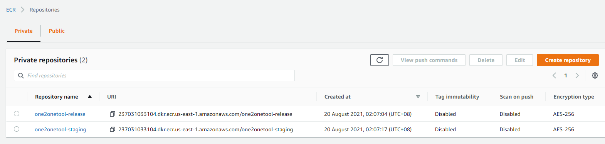
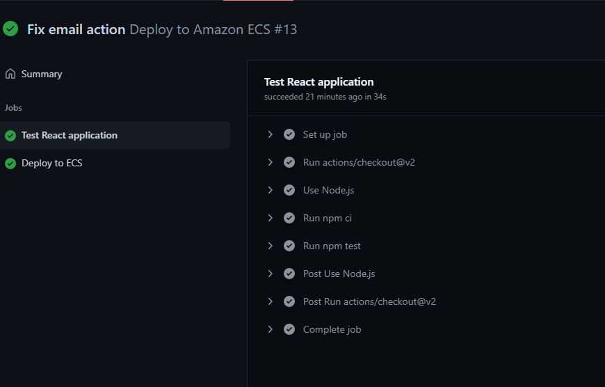
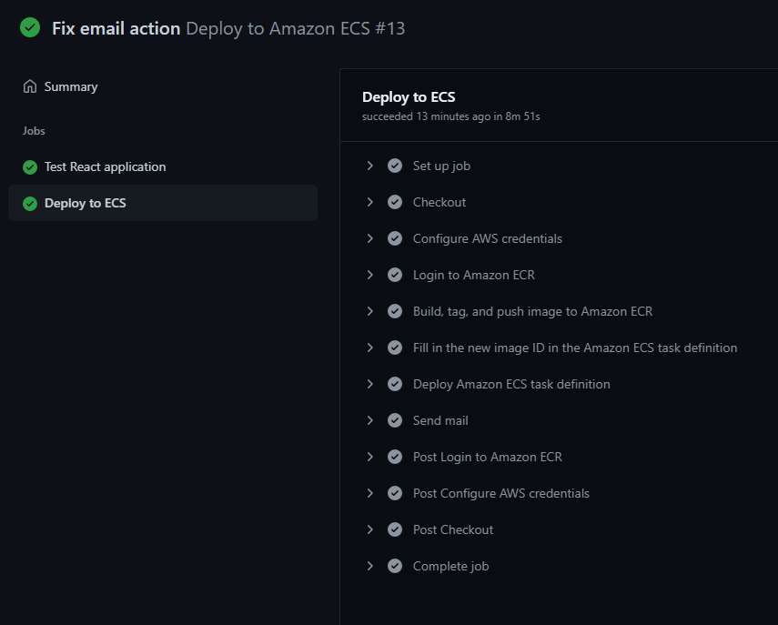
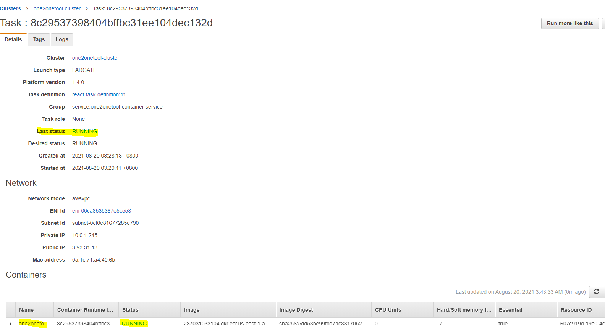
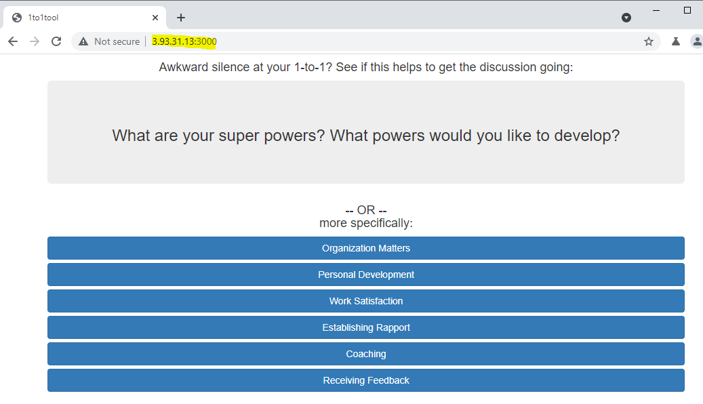

# one2onetool CI/CD pipeline

---

## Requirements

Create a CI/CD pipeline (bash script or any CI/CD tool that you are most comfortable  with) that monitors the “release” and “staging” branches of the repository. The pipeline  should be triggered on new commits and perform at least the following:  
1. The pipeline should build and run tests on the application  
2. Containerise and deploy the application on a public cloud instance  
3. There are two branches, “staging” and “release”:  
  a. The “staging” branch should use “Questions-test.json” as its input data file  
  b. The “release” branch should use “Questions.json” as its input data file  
4. Consider how versioning can be done to differentiate the builds  

If any of the tasks fails at any point, the pipeline should be stopped and an email alert  should be sent with relevant information. 

 

---

## Tools used 

- Cloud platform: AWS
- Hosting service: Amazon ECS (Elastic Container Service)
- Containerization: Docker
- CI/CD pipeline: Github Actions

 

---

## Overview

For this task, [one2onetool react github repo](https://github.com/sngsweekeat/one2onetool) was forked to my Github account. 

A CI/CD pipeline enabled through Github Actions helps to build and test the application, then deploying it to Amazon ECS service to be containerized with the included `Dockerfile`. 

An ALB (Application Load Balancer) is deployed too and acts as a reverse proxy to handle user requests and redirect them to our containerized React application. 

The CI/CD pipeline is triggered when the following conditions are met:

1. Push & pull requests to `staging` branch results in building/testing/deploying the staging branch
2. Push & pull requests to `release` branch results in building/testing/deploying the release branch

When any step in the CI/CD pipeline fails, emails with relevant information are sent to the configured addresses with the `dawidd6/action-send-mail@v2` action defined in `.github/workflows/aws.yml`.

 

---

## Release vs Staging branch

Here lies differences between the release and staging branches.

1. `.github/workflows/aws.yml` - The release branch is built and deployed when a push or pull request is made for the release branch; similar for the staging branch

2. `.github/workflows/aws.yml` - The ECRs (Elastic Container Registry) for the staging branch is called `one2onetool-staging`, while its `one2onetool-release` for the release branch

3. `Dockerfile` - For the release branch, `DATA_FILE` parameter was set as 'Questions.json' while `DATA_FILE` parameter for the staging branch was set as 'Questions-test.json'. This allows the branches to use its respective data files.

 

---

## Replicating the set-up

 

### Managing user roles and permissions

Before creating any items, we're required to create an IAM user with admin privileges. This will serve as our service account. 

We also have to attach a `Permissions policy` for `AmazonECSTaskExecutionRolePolicy` to our `AWS Service`, `Elastic Container Service`. For a detailed guide, please click [here](https://docs.aws.amazon.com/AmazonECS/latest/developerguide/task_execution_IAM_role.html).

Now we're ready to create our resources. 

 

### Creating and configuring ECS with Fargate 
To get started, we are required to create the following services to enable containerization of our web application on AWS ECS:
- ECR repositories
- ECS Cluster
- ECS Service
- ECS Task definition
- ECS Container definition

Starting with the ECR repositories, we can access `Amazon Container Services > Amazon ECR > Repositories` then create the required repositories (one2onetool-release & one2onetool-staging).

 

As for the last four items, we can use the [managed AWS ECS Getting started guide](https://us-east-1.console.aws.amazon.com/ecs/home?region=us-east-1#/firstRun) to create our services and allow them to integrate seamlessly. 

For the container definition, we use the `custom` one and configure it with a `port mapping` of `3000` (Default react listening port).

For the task definition, change the Task definition name to a more user-friendly name like `one2onetool-task-definition`

For our ECS service, we'll define it with an attached Application Load Balancer. 

For our cluster, we can give it a name and proceed to click 'Next' to trigger creation of the resources. 

We can now proceed to enabling Github Actions.

 

### Enabling Github Actions

For Github Actions, access our repository then click on the `Actions` tab above, 

We also have to configure certain secrets under `Settings > Secrets`. These are the following secrets required to enable AWS Account management and sending of errorneous emails respectively:
- AWS_ACCESS_KEY_ID
- AWS_SECRET_ACCESS_KEY
- EMAIL_PASSWORD 
- EMAIL_USERNAME

For the AWS secrets, we may use the access key and secret access key provided upon initial creation of an IAM user.

For the email password, we're required to create an `APP Password` which is different from our user password. You may follow steps [here](https://support.google.com/mail/answer/185833?hl=en) to create it. 

**Github actions (React Test)**

 
**Github actions (Deploy to Amazon ECS)**

 

### Trigger our CI/CD pipeline

Finally, our CI/CD pipeline is ready. 
Proceed to push changes to the react application and watch the 'magic' happen. :)

**ECS Service deployment successful**

**One2onetool website deployed**

 

--- 

## Pitfalls

1. Versioning wasn't considered as a feature for this CI/CD pipeline. Thus managing between version upgrades and handling breaking changes might prove to be more time consuming for operational teams. 

2. There should be an additional container defined for the ECS Service so that we have one container each for staging and release. Currently both branches are deploying its respective application code to the same container which is not ideal. 